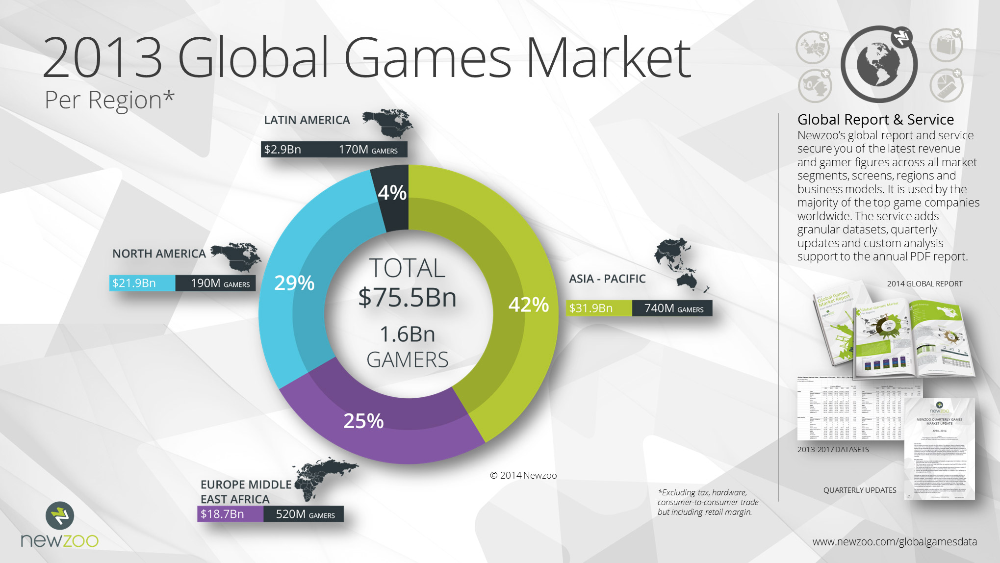
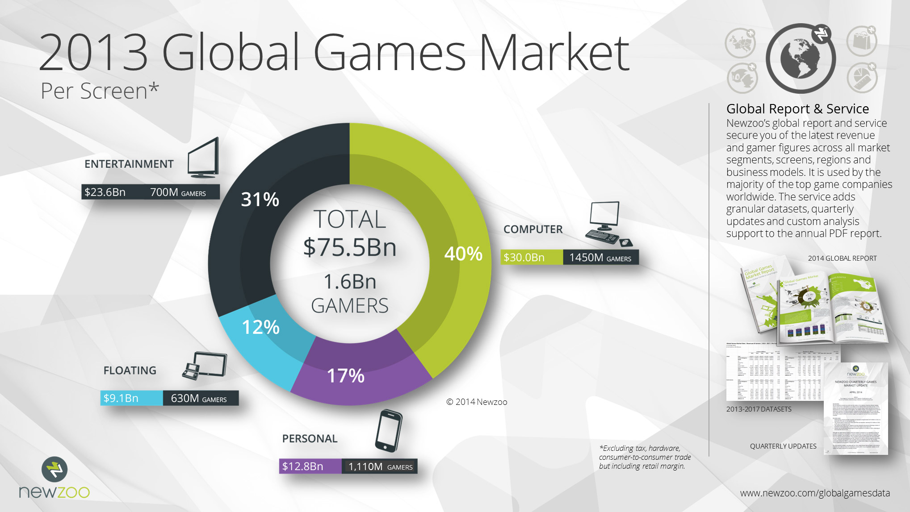
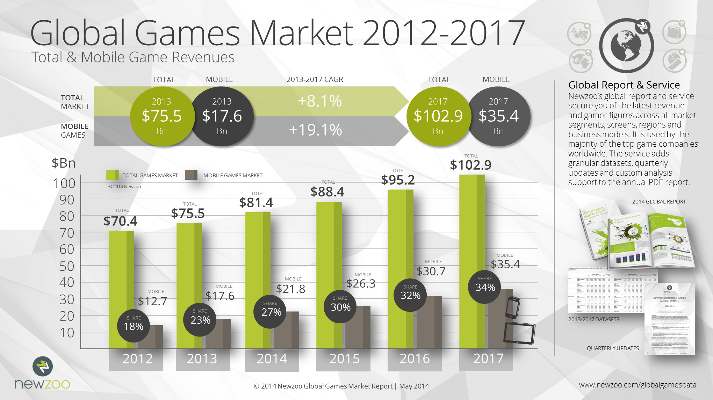
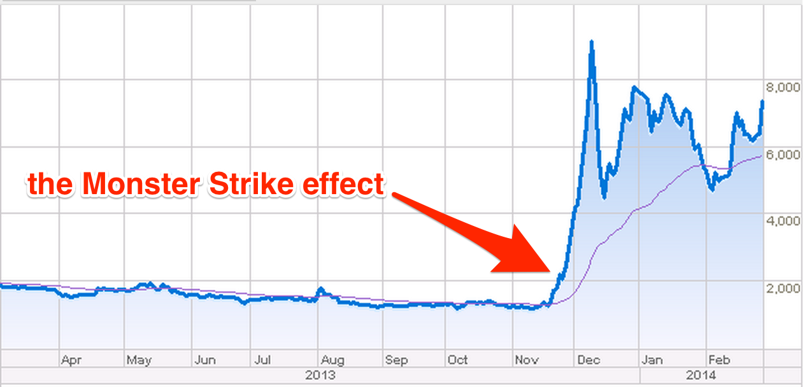
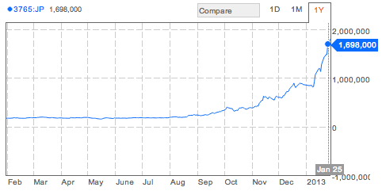
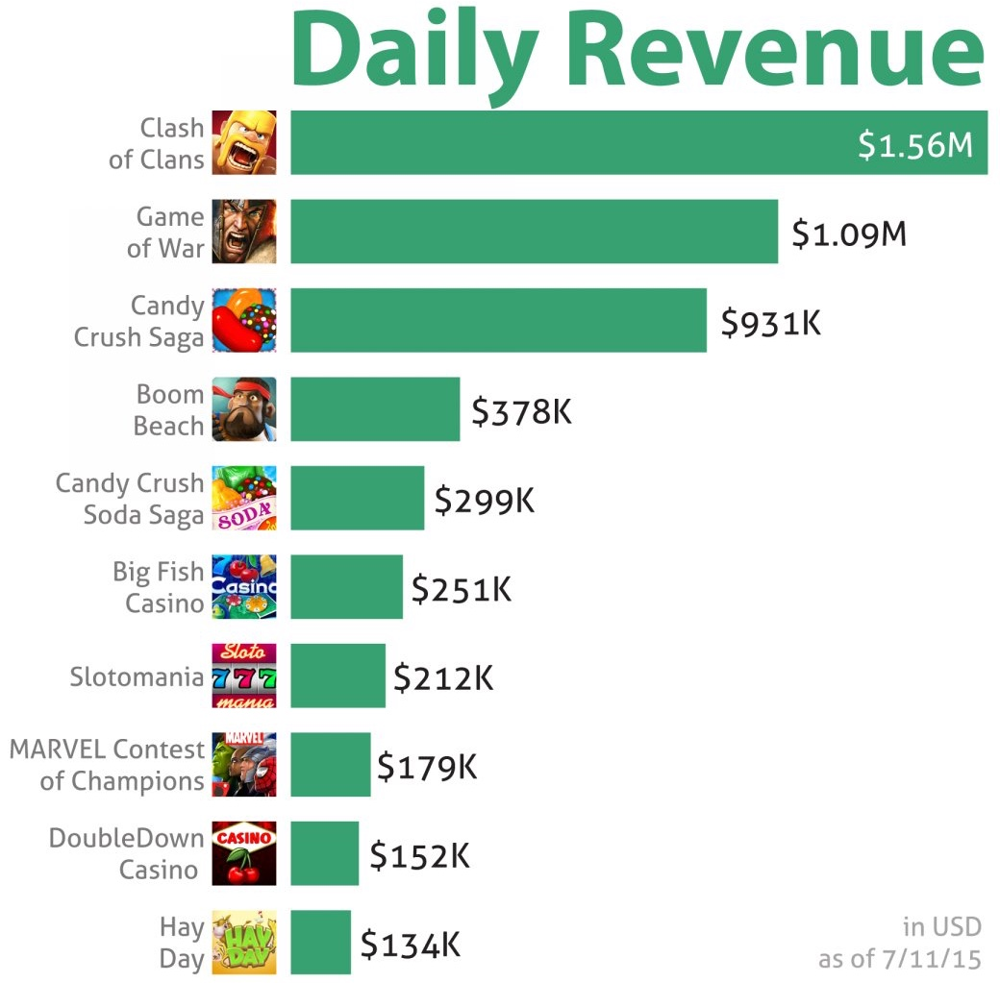
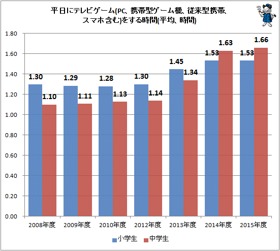

class: center, middle

# Mobile Games

---

# Introduciton

.col-5.fs-l[
- Suguru Motegi
- Software Engineer
]

.col-3[

]

---

# Agenda

1. What is Mobile Game?
2. Market
3. Stocks & Revenues
4. Average time of playing games
5. Discussion

---

class: center, middle

# What is Mobile Game?

---

## What is Mobile Game?

.fs-m[Mobile game is a video game played on mobile phone.]

.col-4[

]

.col-4[

]

---

class: center, middle

# Market

---

## Per Region

.margin_auto[

]

- Games are played around the world.

---

## Per Screen

.margin_auto[

]

- The computer games and entertainment are still the grate majority.

---

## Total & Mobile Game Revenues

.margin_auto[

]

- Extending game market and mobile game market.

---

class: center, middle

# Stocks & Revenues

---
## Monster Strick

.margin_auto[

]

- After the Monster Strike was released, the stock became more than four times.

---

## Puzzle Dragon

.margin_auto[

]

- After the Puzzle Dragon was released, the stock became more than 22 times.

---

## Daily Revenues

.col-6.margin_auto[

]
---

class: center, middle

.col-7.margin_auto[
# Average time of playing games
]
---

## Average time of playing games

.col-6.margin_auto[

]

- Increasing time which children are playing games.

---

# Discussion

- What do you think this market?
- Do you want to invest for stocks of game company?
- What do you think average time of playing games?

---

# Quatation
- RobinsPost.com
  - http://www.robinspost.com/news/
- newzoo.com
  - http://newzoo.com/
- tapscape.com
  - http://www.tapscape.com/
